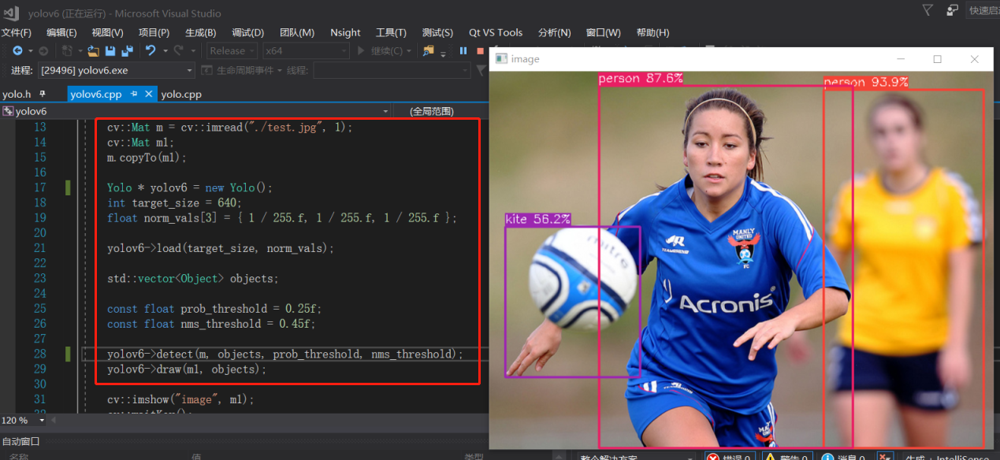
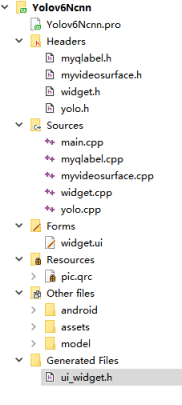

##  YOLOv6 安卓手机部署


>  手摸手实现基于QT和NCNN的安卓手机YOLOv6模型的部署！

假设读者已经正确安装和编译了android版和windows版的ncnn和QT，若果过程中有问题，关于相关环境的配置以及编译可以参考我的另一个github项目<https://github.com/DataXujing/Qt_NCNN_NanoDet>，内有详细的编译ncnn的过程和安卓开发相关详细的配置环境供参考。

你能搜到的开源的和NCNN相关的安卓开发项目均是基于Java实现的。很少使用QT,主要原因是QT作为安卓开发的后端工具其实并不是很流行。本项目带大家一起使用QT和NCNN实现一个简单的安卓程序。

### 1.模型转NCNN

如何将YOLOv6模型转为NCNN支持的模型结构，了解了该过程其实YOLOv5，YOLOX, YOLOv7的做法基本是类似的。

+ 1.直接转ONNX的坑

  如果直接按照YOLOv6官方提供的`export_onnx.py`转出的ONNX，可以正常生成ONNX文件，但是在使用`onnx2ncnn.exe`转ncnn时会出现不支持的层，这种方式显然是不行的。

+ 2.尝试PNNX的坑

  如果直接转ONNX不成立，可否使用`torchscript->pnnx->ncnn`这条路是否可行呢？我们在YOLOv6的`export_onnx.py`中增加生成torchscript的代码：

  ````python
      # TorchScript export  add by xujing
      try:
          print('\nStarting TorchScript export with torch %s...' % torch.__version__)
          f = args.weights.replace('.pt', '.torchscript.pt')  # filename
          ts = torch.jit.trace(model, img, strict=False)
          ts.save(f)
          print('TorchScript export success, saved as %s' % f)
      except Exception as e:
          print('TorchScript export failure: %s' % e)
  ````

  可以生成torchscript模型，然后使用PNNX转化工具

  ```shell
  pnnx yolov6n.torchscript.pt 
  ```

  可以正常实诚ncnn模型，但是在调用时发现仍然有不支持的操作，详细可以参考这个错误： <https://github.com/Tencent/ncnn/issues/4101>. 该错误目前我并没有解决方案。

+ 3.使用ONNX2NCNN

还是回到onnx2ncnn这条道路上来，为了让ncnn支持，我们去掉了检测head中anchor生成检测框的部分的内容，修改代码如下：

```python
#找到 effidehead.py
#修改如下：else中注释部分是原来的，未注释的部分为修改的部分
            if self.training:
                x[i] = torch.cat([reg_output, obj_output, cls_output], 1)
                bs, _, ny, nx = x[i].shape
                x[i] = x[i].view(bs, self.na, self.no, ny, nx).permute(0, 1, 3, 4, 2).contiguous()
            else:
                # y = torch.cat([reg_output, obj_output.sigmoid(), cls_output.sigmoid()], 1)
                # bs, _, ny, nx = y.shape
                # y = y.view(bs, self.na, self.no, ny, nx).permute(0, 1, 3, 4, 2).contiguous()
                # if self.grid[i].shape[2:4] != y.shape[2:4]:
                #     d = self.stride.device
                #     yv, xv = torch.meshgrid([torch.arange(ny).to(d), torch.arange(nx).to(d)])
                #     self.grid[i] = torch.stack((xv, yv), 2).view(1, self.na, ny, nx, 2).float()
                # if self.inplace:
                #     y[..., 0:2] = (y[..., 0:2] + self.grid[i]) * self.stride[i]  # xy
                #     y[..., 2:4] = torch.exp(y[..., 2:4]) * self.stride[i] # wh
                # else:
                #     xy = (y[..., 0:2] + self.grid[i]) * self.stride[i]  # xy
                #     wh = torch.exp(y[..., 2:4]) * self.stride[i]  # wh
                #     y = torch.cat((xy, wh, y[..., 4:]), -1)
                # z.append(y.view(bs, -1, self.no))
                # 修改之后
                # https://blog.csdn.net/weixin_40920183/article/details/125532375
                # x[i] = torch.cat([reg_output, obj_output, cls_output], 1)
                x[i] = torch.cat([reg_output, obj_output.sigmoid(), cls_output.sigmoid()], 1)
                bs, _, ny, nx = x[i].shape
                # x(bs,255,20,20) to x(bs,1,20,20,85=80+5) (bs,na,ny,nx,no=nc+5=4+1+nc)
                # x[i] = x[i].view(bs, self.na, self.no, ny, nx).permute(0, 1, 3, 4, 2).contiguous()
                x[i] = x[i].view(bs, self.na, 85, -1).permute(0, 1, 3, 2).contiguous()  # (b,self.na,20x20,85) for NCNN
                x[i] = x[i].view(bs, -1, 85)
        return torch.cat(x, dim=1)  # (b,?,85)

        # return x if self.training else torch.cat(z, 1)

```

替换原来的代码，重新生成onnx并基于onnx-simplifier生成simplifier后的onnx.

然后生成ncnn支持的模型

```shell
onnx2ncnn yolov6n_sim.onnx yolov6n.param yolov6n.bin
```


此时不会报没有支持的层了！

+ 4.ncnnoptimize生成FP16模式的模型

生成FP16模式的模型

```shell
ncnnoptimize.exe yolov6n.param yolov6n.bin yolov6_opt.param yolov6n_opt.bin 65536
```

成功生成FP16模式的ncnn模型。


### 2. VS下编写NCNN模型调用

有了NCNN模型，我们开发基于NCNN的C++程序，测试模型的可用性。

<div align=center>

</div>


可以正常运行！


### 3.基于QT的NCNN安卓程序编译

将上述VS开发的类集成到安卓程序中。其代码结构为：

<div align=center>

</div>

### 4.Demo

|                                                              |                                                              |
| ------------------------------------------------------------ | ------------------------------------------------------------ |
| 

|

 |


### 5.download

+ apk下载地址： <https://github.com/DataXujing/ncnn_android_yolov6/releases>